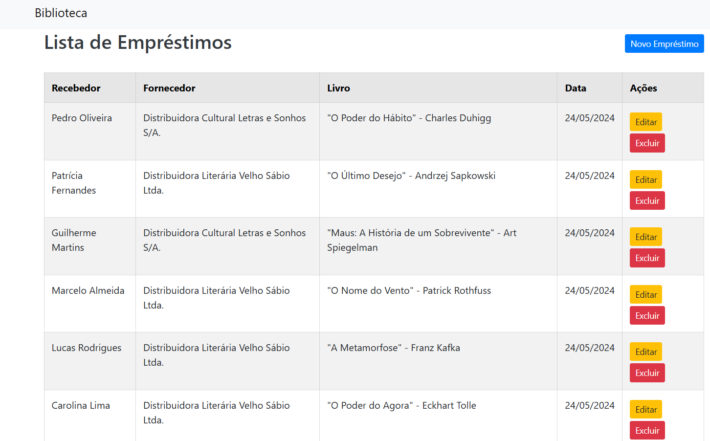

# Projeto de Gerenciamento de Empréstimos de Livros em .NET

Este projeto em .NET, desenvolvido no Visual Studio, é uma biblioteca para gerenciar empréstimos de livros. Ele inclui funcionalidades para:

- Registro de empréstimos de livros, armazenando dados como nomes dos receptores e fornecedores, título do livro e datas de empréstimo.
- Visualização dos empréstimos registrados em uma tabela, com opções para editar e excluir cada entrada.
- Formulário de edição para modificar informações de empréstimos existentes.
- Conexão com um banco de dados SQL Server para armazenar e gerenciar os dados de forma eficiente.

## Funcionalidades

- **Registro de Empréstimos**: Permite registrar novos empréstimos de livros, incluindo informações como nome do receptor, fornecedor, título do livro e datas de empréstimo.

- **Visualização e Edição de Empréstimos**: Apresenta os empréstimos registrados em uma tabela, permitindo a edição das informações de cada empréstimo através de um formulário específico.

- **Exclusão de Empréstimos**: Oferece a funcionalidade de excluir registros de empréstimos diretamente da tabela.

- **Conexão com Banco de Dados**: Utiliza uma conexão com um banco de dados SQL Server para armazenar e gerenciar os dados de empréstimos de forma segura e eficiente.

## Tecnologias Utilizadas

- **Linguagem de Programação**: C#
- **Framework**: .NET Framework ou .NET Core
- **Banco de Dados**: SQL Server
- **IDE**: Visual Studio

## Estrutura do Projeto

O projeto é estruturado de forma a separar claramente as diferentes partes da aplicação, incluindo:

- **Camada de Apresentação**: Contém as interfaces de usuário (UI), como formulários para registro, visualização e edição de empréstimos.
- **Camada de Negócios**: Responsável pela lógica de negócios da aplicação, incluindo a manipulação dos dados dos empréstimos.
- **Camada de Acesso a Dados**: Lida com a comunicação com o banco de dados, incluindo consultas, inserções, atualizações e exclusões de dados.

## Como Utilizar

1. Clone ou baixe o projeto do repositório.
2. Abra o projeto no Visual Studio.
3. Certifique-se de configurar a conexão com o banco de dados SQL Server corretamente.
4. Compile e execute o projeto.
5. Utilize as funcionalidades fornecidas pela aplicação para gerenciar os empréstimos de livros.

---
